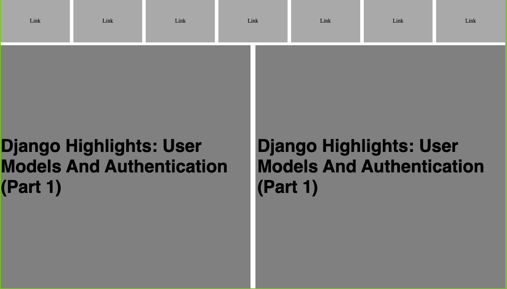

# Design-Teardown-Smashing-Magazine

Design Teardown- Smashing Magazine
  
# What it does  
  
It is a heatmap that highlights areas on the https://www.smashingmagazine.com/ page, according to their hierarchy and visibility. Gray, light gray, and dark gray colours were used to identify the different areas of the page in the heatmap.
  
## Screenshot

## Built With  
  
- HTML
- CSS

  
## Live Project  

[Design Teardown](https://gracious-jang-d7edc2.netlify.com/)  

## Getting Article Started  
You may use the following steps to get a local copy:
  
Clone project to your local machine  
cd to the project directory  
Open project in IDE  
Open Live Preview through IDE or use localhost to view the project in your browser  
  
## 🤝 Contributing
You are welcome to make contributions to the repository. Contributions may be made through issues comments and feature requests.

You may find the issues page [here](https://github.com/Calvinoea/Design-Teardown-Smashing-Magazine/issues)

## 👤 Authors

# Mupa M'mbetsa

- Github: [@mupa1](https://github.com/Mupa1)
- Twitter: [@mupa_mmbetsa](https://twitter.com/mupa_mmbetsa)
- Linkedin: [mupa](https://www.linkedin.com/in/mupa_mmbetsa)

# Calvin
- GitHub [here](https://github.com/calvinoea/)
- Twitter: [@yasukeoz](https://twitter.com/yasukeoz)

## Show your support  
Give a ⭐️ if you like this project!

## 📝 License  
This project is MiT licensed.

The project has been carried out using HTML, CSS, Stickler, and HTML validation. 

Please find below links to the live demo :

